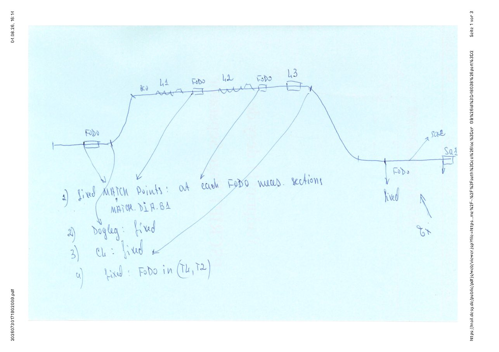
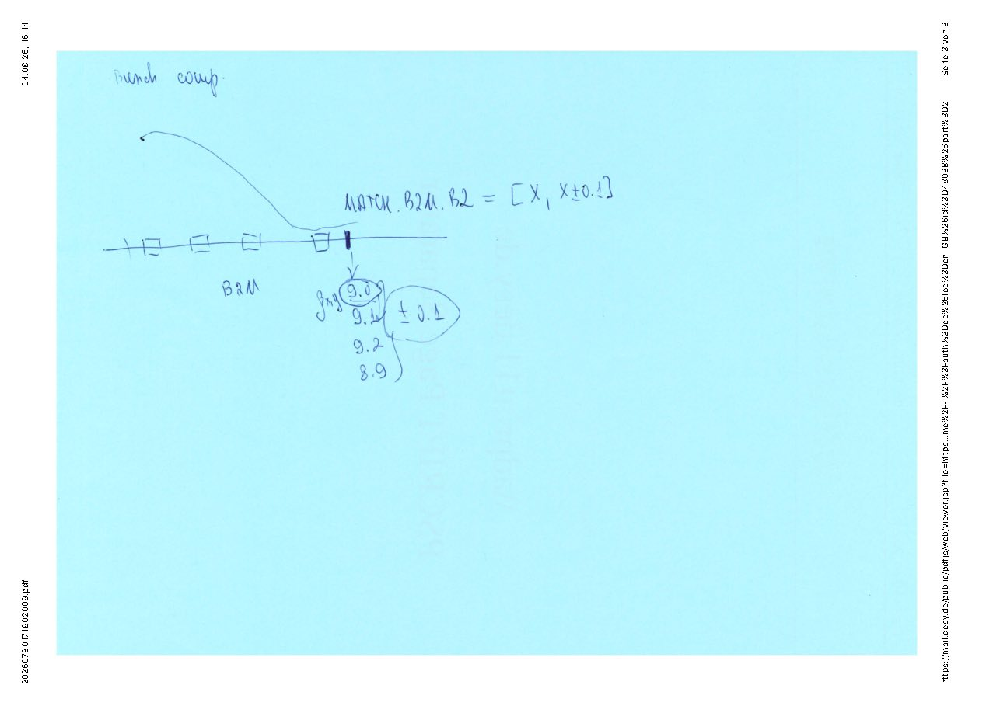

# Match points

The lattice carries eighteen `MATCH.*` markers, and
`euxfel.optics.FIXED_MATCH_POINTS` treats ten of them as *fixed* — points whose
optics must not move when quadrupoles are re-matched. Which ten, and why, was
never written down; the list arrived with a couple of `??? Why must this be
fixed ???` comments still attached.

This page records the reasoning, from N. Golubeva's sketches. The originals are
[in the repository](images/matchpoints-sketch-nina.pdf) — three pages, of which
the first and last carry the content.

## The rule



The sketch runs left to right through the machine: the injector FODO, then BC0,
L1, FODO, L2, FODO, L3, down through the collimation section, and finally the
FODO feeding SA1 and SA2. Four rules are annotated:

1. **Fixed match points at each FODO between sections** — `MATCH.DIA.B1` is
   called out as the example.
2. **Dogleg: fixed**
3. **CL: fixed**
4. **Fixed: the FODO in T4 and T2**

with `ε_x` marked against the FODO ahead of SA1.

So the principle is: **a match point is fixed where a periodic structure begins
or ends.** A FODO channel has a matched solution of its own, and a section
handing beam into one must deliver that solution or the beam mismatches and
filaments. Everywhere else the optics are free, because nothing downstream
depends on their particular value.

That also explains the entries whose purpose had been lost. `MATCH.104.I1` —
the one carrying `??? Why must this be fixed ???` — is the entrance to a FODO,
which is rule 1.

## Match targets are bands, not points



The third page makes a point the code does not currently express:

```
MATCH.B2M.B2 = [ X, X ± 0.1 ]
```

with candidate values 8.9, 9.0, 9.1, 9.2 grouped under `± 0.1`. The match target
at a bunch compressor is a **tolerance band**, not a single number — anything
within ±0.1 is matched.

`conversion.py`'s `matching` block re-matches to a single value, so this
tolerance is not represented. Worth knowing before anyone tightens a matching
routine to chase a number that was never meant to be exact.

## The names do not agree, and the mapping matters

The sketches use MAD-8's names; `sections.py`, the s2e scripts and the control
system use the generated `NAME1`. `MATCH.B2M.B2` above is *not* one of the fixed
points — that is `MATCH.DIA.B2`. Reading the sketch against
`FIXED_MATCH_POINTS` without this table will mislead.

| MAD-8 name | generated `NAME1` | fixed |
|---|---|:-:|
| `MATCH.FQ.I1`    | `MATCH.37.I1`     | |
| `MATCH.QI52.I1`  | `MATCH.52.I1`     | ✓ |
| `MATCH.DIA.I1`   | `MATCH.55.I1`     | |
| `MATCH.DLG.I1`   | `MATCH.73.I1`     | ✓ |
| `MATCH.PS.I1`    | `MATCH.104.I1`    | ✓ |
| `MATCH.B1.B1`    | `MATCH.174.B1`    | |
| `MATCH.B1M.B1`   | `MATCH.202.B1`    | |
| `MATCH.TDS.B1`   | `MATCH.207.B1`    | |
| `MATCH.DIA.B1`   | `MATCH.218.B1`    | ✓ |
| `MATCH.B2.B2`    | `MATCH.385.B2`    | |
| `MATCH.B2M.B2`   | `MATCH.414.B2`    | |
| `MATCH.TDS.B2`   | `MATCH.428.B2`    | |
| `MATCH.DIA.B2`   | `MATCH.446.B2`    | ✓ |
| `MATCH.L3.L3`    | `MATCH.525.L3`    | ✓ |
| `MATCH.ARC.CL`   | `MATCH.1673.CL`   | ✓ |
| `MATCH.UND.SA1`  | `MATCH.2248.SA1`  | ✓ |
| `MATCH.UND.SA2`  | `MATCH.2197.SA2`  | ✓ |
| `MATCH.UND.SA3`  | `MATCH.2813.SA3`  | ✓ |

The MAD-8 names say what each point is *for* — `DLG` dogleg, `ARC` the
collimation arc, `UND` an undulator entrance, `TDS` a transverse deflector, `DIA`
a diagnostic section — which the positional names lose entirely.
`makelist_release.m` rebuilds them as `TYPE.floor(Z).SECTION`, so `MATCH.DLG.I1`
becomes `MATCH.73.I1` and the meaning goes with it. Both are kept on every
element: the generated name as `id`, the MAD-8 name as `ps_id`.

Regenerate this table with:

```python
from euxfel.mad8_import import build_sequence
from euxfel.optics import FIXED_MATCH_POINTS

for element in build_sequence("T5D"):
    mad8 = getattr(element, "ps_id", "")
    if mad8.startswith("MATCH"):
        print(mad8, element.id, element.id in FIXED_MATCH_POINTS)
```

## Two things this does not settle

**The sketch's rules and `FIXED_MATCH_POINTS` have not been reconciled.** Rule 4
names "the FODO in T4 and T2", but no `T2` or `T4` point appears in the list —
the three `MATCH.UND.SA*` entries are undulator entrances, which may be what was
meant, or may not. Worth checking against the sketch rather than assuming the
list is right.

**The ±0.1 band is not implemented anywhere**, only recorded here.
